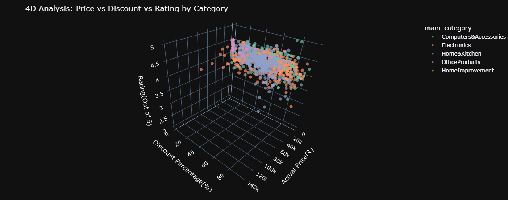
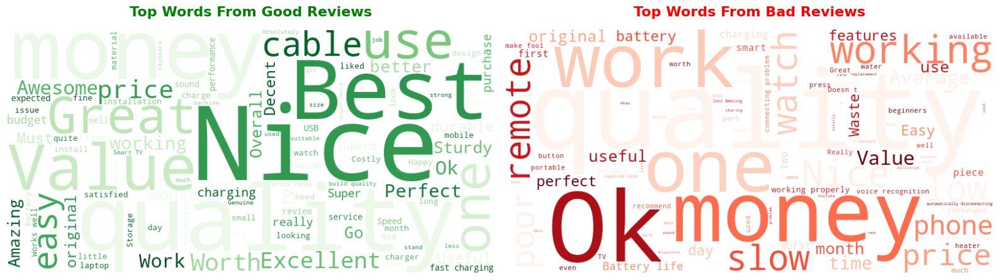

# 🛒 Amazon India E-Commerce Deep Dive: EDA & NLP Analysis
Streamlit deployed link: https://mayank-kumar-amazon.streamlit.app/


[](https://www.python.org/)
[](https://pandas.pydata.org/)
[](https://plotly.com/python/)
[](https://streamlit.io/)

## 📌 Project Overview
This project goes beyond standard data visualization. It is a comprehensive Exploratory Data Analysis (EDA) of a massive Amazon India dataset, utilizing advanced interactive libraries and Natural Language Processing (NLP) to uncover hidden market segments, pricing strategies, and customer sentiment. 

The initial goal was to analyze basic correlations (Price vs. Rating), but the project quickly evolved into a multi-dimensional analysis using 3D spatial mapping and textual sentiment extraction.

## 🛠️ Tech Stack & Libraries Used
* **Data Manipulation:** `pandas`, `numpy`
* **Static Visualizations:** `matplotlib`, `seaborn`
* **Interactive Visualizations:** `plotly.express` (Treemaps, 3D Scatter, Violin-Box hybrids)
* **Natural Language Processing (NLP):** `wordcloud`
* **Deployment (In Progress):** `streamlit`

## 🚀 Key Features & Methodologies
## 📊 Key Insights & Visualizations

*(Note to recruiters: The interactive Plotly versions of these charts are available in the Jupyter Notebook and the live Streamlit app!)*

### 1. The "Overplotting" Illusion (Price vs. Rating)

> **The Insight:** Initially, standard scatter plots hid the true density of the data behind a solid wall of dots. By applying mathematical **jitter** and **alpha transparency**, the true distribution was revealed: massive clusters of products sit solidly at the 3.8 to 4.2 rating mark, heavily concentrated at the lower price tiers.


### 2. Market Segmentation (Hierarchical Treemap)

> **The Insight:** Standard bar charts failed to capture the Parent-Child hierarchy of Amazon's catalog. Using Plotly, this interactive Treemap successfully maps the ecosystem, instantly revealing which specific subcategories (like Cables or Smartwatches) physically dominate their massive parent categories.


### 3. Category Distributions (Violin-Box Hybrids)

> **The Insight:** To understand market quality, we compared numerical ratings across categorical groupings. This hybrid plot embeds a statistical boxplot inside a density violin, proving that while certain categories have massive volumes, their median ratings often skew lower and have a much wider variance (risk) than others.

### 4. 4D Multivariate Analysis (3D Scatter)

> **The Insight:** Real-world retail success relies on multiple factors at once. This 3D mapping plots *Actual Price (X)*, *Discount Percentage (Y)*, and *Rating (Z)*, color-coded by *Category*. It uncovers hidden spatial "sweet spots" where specific discount tiers predictably yield 4.5+ star ratings.


### 5. Customer Sentiment Analysis (NLP Word Clouds)

> **The Insight:** Numbers indicate *what* happened; text explains *why*. By extracting thousands of review titles, applying custom Stopword filters, and splitting them by rating thresholds (>4.2 vs <3.5), these Word Clouds visually map exact customer pain points against product praise.


### 1. Upgraded Visualizations (Moving to Interactive)
Static charts often hide the true density of data due to "overplotting." By upgrading to interactive **Plotly** visualizations, I was able to map the data more accurately:
* **Hierarchical Treemaps:** Solved the "categorical clutter" problem by visually nesting Subcategories inside Main Categories, revealing that items like *Smartphones* dominate the *Electronics* parent block.
* **4D Multivariate Analysis:** Built a 3D Scatter Plot mapping *Actual Price*, *Discount Percentage*, and *Rating*, color-coded by *Category*. This allowed for orbiting and zooming to find hidden clusters of high-performing, heavily discounted products.

### 2. NLP: The "Why" Behind the Ratings
Numbers indicate *what* happened, but text explains *why*. 
* I extracted thousands of raw customer review titles and applied custom Stopword filters to remove generic terms (e.g., "Amazon", "Product").
* Generated comparative **Word Clouds** splitting >4.2-star reviews against <3.5-star reviews, instantly visualizing the emotional drivers and specific product failures behind 1-star ratings.

### 3. Critical Business Thinking: "The Revenue Trap"
During feature engineering, I attempted to create an `estimated_revenue` column by multiplying `rating_count` (as a proxy for sales volume, assuming a 2% review rate) by the `discounted_price`. 
* **The Catch:** I caught a critical logical flaw before finalizing the data. `rating_count` is a **lifetime** metric spanning years, while `discounted_price` is a **snapshot** metric representing a temporary, single-day flash sale. 
* **The Solution:** Multiplying these together would manufacture millions in fake historical revenue. Instead, I pivoted to calculating **Revenue Ranges** (Best-Case vs. Worst-Case scenarios) using MSRP vs. Discounted rates, ensuring data integrity.

## 💻 How to Run This Project Locally

1. **Clone the repository:**
   ```bash
   git clone [https://github.com/](https://github.com/)[YourUsername]/[YourRepoName].git
